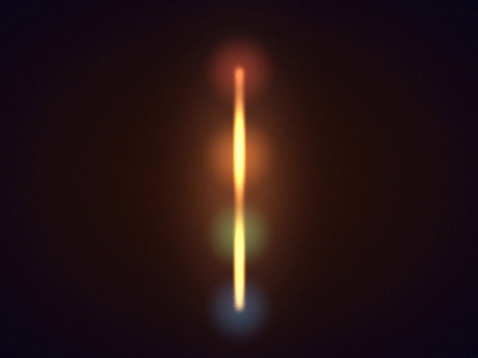
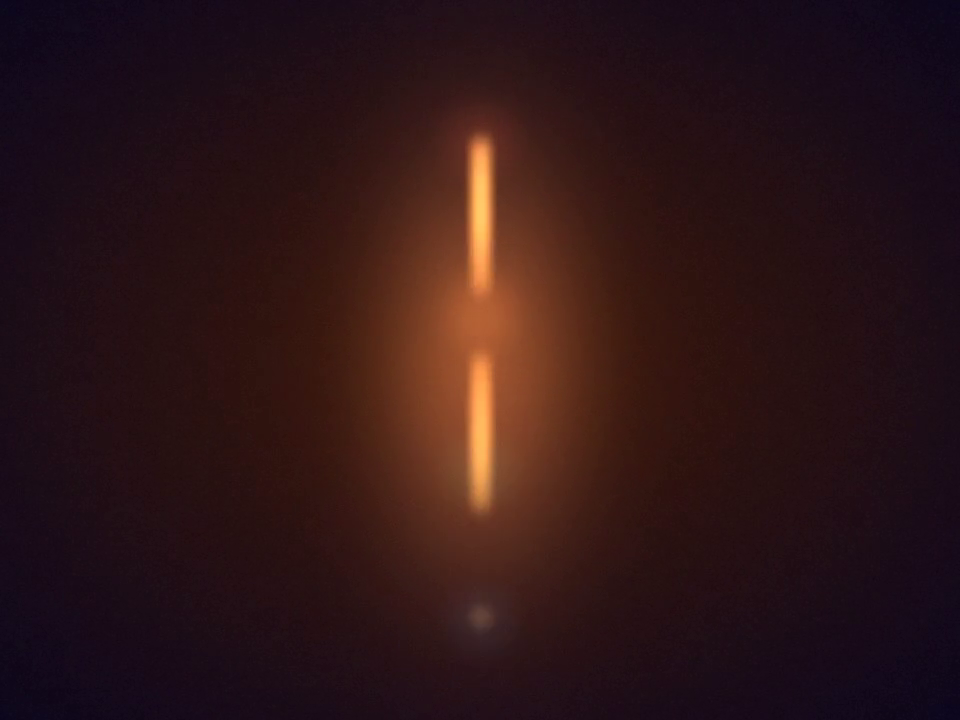
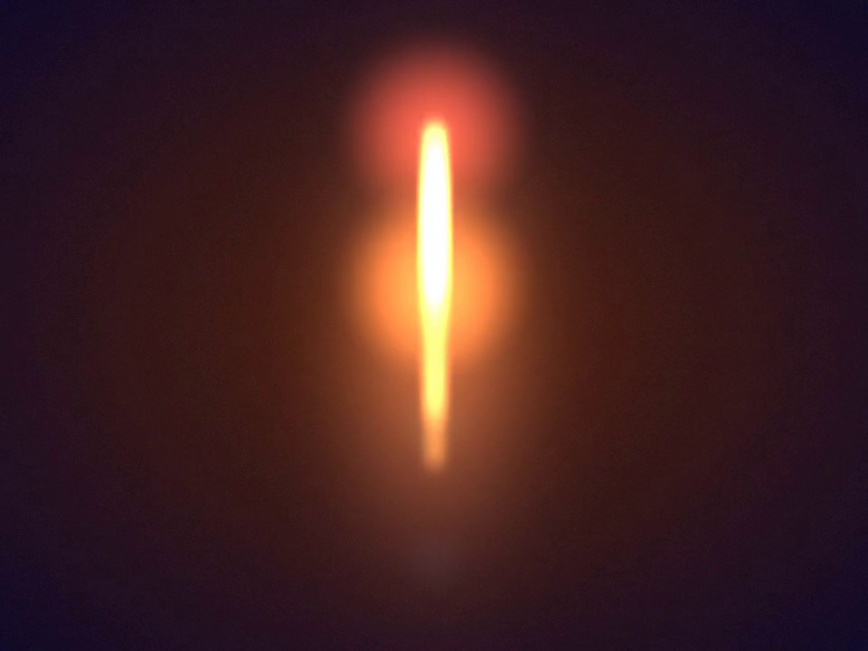

# FOCtave

**Convert stereo e-stim audio into 4-phase restim funscripts for FOC-Stim.**

FOCtave takes a traditional stereo e-stim audio file (WAV / FLAC / MP3) and
produces the five funscripts that [restim](https://github.com/diglet48/restim)
auto-detects when running in FOC-Stim 4-phase mode:

```
<name>.e1.funscript   -> intensity A  \
<name>.e2.funscript   -> intensity B  /  (pair 1, driven by L envelope)
<name>.e3.funscript   -> intensity C  \
<name>.e4.funscript   -> intensity D  /  (pair 2, driven by R envelope)
<name>.volume.funscript -> volume
```

The electrode pair duplication preserves the original stereo topology on a
4-electrode [FOC-Stim](https://github.com/diglet48/FOC-Stim) box: `(e1, e2)`
act as one bipolar terminal and `(e3, e4)` act as the other, so the track
feels the same way it would on a traditional two-channel stimulator - while
also gaining free cross-coupling between pairs thanks to FOC-Stim's any-to-any
routing.

---

## Quick start

```bash
pip install -r requirements.txt
python foctave.py path/to/your_track.wav
```

That's it - five `.funscript` files appear next to the audio, and restim
will auto-detect them when you point it at the matching media file.

MP3 / M4A / OGG inputs work if `ffmpeg` is on your `PATH`.

---

## How it works

1. Load the stereo audio.
2. Take the amplitude envelope of each channel:
   `|signal|` -> 20 Hz low-pass.
3. Compress the envelope with a gentle gamma curve (default cube root) so
   quiet passages stay feel-able without flattening peaks.
4. Normalize to 0-100 using a high percentile (not the absolute peak) so a
   single loud transient doesn't squash the rest of the track.
5. Downsample to ~30 Hz (one action every 33 ms) and dedupe consecutive
   identical values.
6. Duplicate L -> `e1` + `e2`, R -> `e3` + `e4`, RMS -> `volume`.

Defaults are empirically tuned against real-world 4-phase content to
produce a close match to established stereo-to-4-phase conversion styles.

---

## Presets

Four built-in presets cover the common use cases. Pick with `--preset`;
defaults to `belgium`.

```bash
python foctave.py input.wav                        # belgium (default)
python foctave.py input.wav --preset comfort
python foctave.py input.wav --preset dynamic
python foctave.py input.wav --preset endurance
```

| Preset | gamma | percentile | attack / release | floor | vol ramp | Feel |
|---|---:|---:|---:|---:|---:|---|
| `belgium` | 0.30 | 75 | - | - | - | Faithful FunBelgium-style punch; e-channels pegged at 90-100 for ~60% of the track. |
| `comfort` | 0.40 | 85 | 15 / 120 ms | 0.05 | - | Less saturated, musical transients, quiet sections never hit zero. Gentle. |
| `dynamic` | 0.50 | 95 | 10 / 80 ms | 0.03 | - | Closer to the source audio's actual loudness curve — loud stays loud, quiet stays quiet. |
| `endurance` | 0.35 | 80 | 20 / 150 ms | 0.08 | 0.5 %/min | Moderate baseline + gradual ramp-up over time. Designed for long tracks. |

### Individual tuning knobs

Any of these flags override the active preset:

| Flag | What it does |
|---|---|
| `--rate` | Funscript sample rate in Hz (default 30) |
| `--smooth` | Envelope low-pass cutoff in Hz (default 20) |
| `--gamma` | Compression curve exponent. 1.0 = linear, 0.5 = sqrt, lower = punchier. |
| `--percentile` | Normalization percentile (100 = peak). Lower = more saturation. |
| `--attack-ms` | Asymmetric attack time (ms). Fast catches transients. |
| `--release-ms` | Asymmetric release time (ms). Slow avoids choppy cutoff. |
| `--floor` | Minimum intensity 0-1. Prevents "did it disconnect?" moments. |
| `--volume-ramp` | Additive ramp on the volume channel in %/minute. |

Example - start from `comfort` but crank saturation:

```bash
python foctave.py input.wav --preset comfort --gamma 0.30 --percentile 75
```

---

## Output format

FOCtave writes the minimal funscript JSON used by restim's auto-detect:

```json
{"actions": [{"pos": 72, "at": 0}, {"pos": 74, "at": 33}, ...]}
```

`pos` is `0-100` intensity; `at` is milliseconds from start.

---

## Video pipeline (optional)

restim drives its timeline from a media file playing in MPC-HC. You can
point it at the source audio, but staring at a blank player is no fun -
so FOCtave ships two extra tools to generate a visualisation video that
plays in sync, with animated electrode glows showing exactly where
current is flowing at any moment.

### 1. Click electrode positions onto your still

```bash
python place.py path/to/your_still.jpg
```

A window opens with your image. Click four times in order (e1, e2, e3,
e4). Right-click undoes the last click. Positions get saved to
`your_still.electrodes.json`.

### 2. Render the video

```bash
python render.py path/to/your_still.jpg
```

Picks up the funscripts and audio from the same directory automatically.
Writes `your_still.mp4` alongside. Load that into MPC-HC instead of the
raw audio and restim will time against it the same way.

**What you get per frame:**

- Base image, brightness breathing with the volume channel
- Pre-blurred bloom layer that pulses along with volume (the image itself
  glows when the action peaks)
- Four radial glows at the clicked electrode positions - radius and
  brightness driven by e1, e2, e3, e4 values
- A flowing ribbon along the polyline e1 -> e2 -> e3 -> e4. The ribbon's
  brightness at every point is the weighted average of the two nearest
  electrode values, so a point midway between e2 and e3 literally feels
  like `0.5 * e2 + 0.5 * e3`. A traveling-wave modulation makes the
  signal visibly flow along the line instead of sitting static.

The ribbon metaphor matches how longitudinal e-stim electrode placements
actually feel - "snake head, necktie, snake belly, snake tail" - where
sensation lives in the tissue *between* the electrodes, not just at them.

### Example frames

From a 12-second synthetic demo (see `examples/demo/`):

| t = 2 s | t = 5 s | t = 11 s |
|---|---|---|
|  |  |  |
| e1/e2 pair throbbing, e3/e4 faint - you can see all four electrodes' assigned colors | e2/e3 both low mid-track, so the ribbon goes dark between them - the gap IS the data | Volume ramp has peaked; bloom spreads warm light into the base image |

Reproduce locally with:

```bash
python render.py examples/demo/demo.jpg --max-dim 960 --bloom 0.6 --min-dim 0.65
```

### Useful flags

```bash
# Preview the first 10 seconds
python render.py image.jpg --duration 10

# Higher resolution (slower)
python render.py image.jpg --max-dim 1920

# Less bloom / dimmer base
python render.py image.jpg --bloom 0.25 --min-dim 0.75
```

### Performance

MVP render speed is roughly real-time on 1280x720 (a 30-minute track
takes ~30 minutes to render). Use `--duration` for quick previews while
you iterate on electrode placement or tuning.

---

## Requirements

- Python 3.11+ (older may work; tested on 3.11)
- `numpy`, `scipy`, `soundfile` (see `requirements.txt`)
- `ffmpeg` on `PATH` for non-WAV/FLAC inputs

---

## Credits

- [restim](https://github.com/diglet48/restim) by diglet48 - the e-stim
  control software this tool targets.
- [FOC-Stim](https://github.com/diglet48/FOC-Stim) by diglet48 - the
  hardware this tool is designed for.
- Inspired by reverse-engineering the stereo-to-4-phase conversion style
  used by FunBelgium's published scripts.

---

## License

MIT - see [LICENSE](LICENSE).
